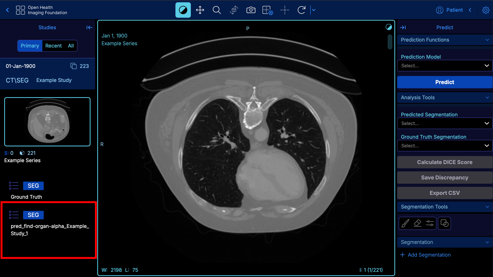

## Image Directory Page

The initial landing page for the client application is the image directory, which lists any viewable study stored in the back end DICOM server. Assuming a fresh installation of the project, this page should be empty. Press the **Upload** button to upload DICOM files to the server. Please not that further management of studies such as renaming of labels and deletion will need to be handled within a separate interface. There is no authentication process for accessing studies, as QuickDraw is intended to be a research tool and not meant for secure systems. It is not recommended to upload sensitive data in any form.

<p align="center">
  
</p>

Once a DICOM study has been successfully uploaded, the list will be populated with an entry and various methods of filtering studies such as by patient name or modality will function as intended. In order to view a study, click the associated entry and then press the **Prediction Analysis** button on the right side of the menu. Note that while the **Basic Viewer** and **Segmentation** buttons are available, they provide only stock OHIF Viewer functionalities such as basic viewing and modification of segmentations.

<p align="center">
  
</p>

## Running a Prediction

This guide assumes that a valid Google Cloud Services (GCS) project has been setup using the instructions in the [README]("../README.md") file and that a model has been uploaded for use. Without a valid GCS project setup, execution of predictions will not function. The model used in this document segments a CT scan by organ, but any model which meets specifications will also work identically.

To begin the prediction process, select a model from the top right corner of the right side panel, then click the predict button. At the time of writing, a single instance is available per-model, and a prediction can only be run on an idle model. If a model is currently running a prediction process, it's name will be prepended with the _*[Running]*_ tag.

<p align="center">
  
</p>

Once the prediction has started, a light blue bar will be visible at the top of the panel and indicate the progress of the prediction. Messages will appear in the bottom right corner with a description, including when the prediction has been completed and also downloaded back the DICOM server.

```
Status Update

Prediction done. Reload to see changes.
```

Once the above message has appeared in the bottom right screen, the page should be reloaded and the generated segmentation will appear in the bottom left corner of the screen. This name is generated from basic label parameters such as the study and model name.

<p align="center">
  
</p>

## Analysis of Segmentations

QuickDraw is equipped with both a quantitative and visual tool to determine the accuracy of a predicted segmentation relative to a predetermined truth value, or a _*ground truth*_. The DICE coefficient metric provides a decimal value ranging from zero to one which describes the similarity of two segmentations. In order to visualize the differences, a discrepancy segmentation can be generated.

To calculate DICE scores, selected two segmentations from the drop down. The coefficients are calculated relative to the predicted segmentation, such that if a region of interest (ROI) appears on the predicted segmentation but not on the truth segmentation, it will appear with a a score of zero.

<p align="center">
  
</p>

Once the DICE scores have been calculated, they will appear in the bottom right corner of the panel, under the section labeled _*Segmentation*_. Note that on smaller displays, it might be necessary to scroll down.

A discrepancy segmentation can also be generated from the same selection and once complete the page will need to be refreshed much like when a prediction is completed. The discrepancy segmentation will appear in the bottom left corner of the page.

## Viewing Segmentations

To load and view a segmentation, double click the segmentation in the list on the left side of the page. When the progress bar disappears, press either the **Yes** button in the pop-up, or the **Load** button in the top left corner of the image view.

<p align="center">
  
</p>

Loading the segmentation will populate the bottom right corner of the page with a list of ROIs, each of which is assigned a distinct color. Pressing the slider icon in the _*Segmentation*_ section header opens a menu to adjust the way each ROI is displayed in the viewer.

<p align="center">
  
</p>

It is also possible to load multiple segmentations at once, which will be layered on top of each other. The active segmentation is selected through the primary segmentation drop down. Inactive segmentations will abide by the opacity set in the _*Inactive Segmentations*_ section of the previously mentioned options.

<p align="center">
  
</p>

## Editing Segmentations

The OHIF Viewer provides a set of tools to modify segmentations, which include a circle/sphere and eraser brushes. To modify the desired ROI, select it in the list and then use the provided brush tools to make the desired changes. Please note that this is not meant to be a fully featured editor, and mostly meant for quick changes to the segmentation. It is also not possible to modify the segmentation in place, and a modified copy will be exported under a separate identifier.

<p align="center">
  
</p>

Above the ROI list is a toolbox which provides functionality for:
- Creating new segmentations.
- Exporting/Saving a modified segmentation.
- Renaming the currently active segmentation. (This will NOT rename in place, just like making changes to the segmentation itself.)
- Unloading the active segmentation.
- Hide/Show all ROI in the segmentation.

<p align="center">
  
</p>

When exporting a segmentation, a prompt will ask for the name of the new segmentation. The viewer will show the new segmentation in the bottom left corner of the screen WITHOUT needing to reload the page.

## Further Documentation

For further information on how the OHIF Viewer works, visit it's dedicated documentation [page](https://docs.ohif.org). Much of the functionality of QuickDraw relies and is built from base OHIF Viewer functionality, and as such many of the features such as segmentation editing work nearly identically.

To learn about the Orthanc DICOM server, and how to manage studies within it's interface, visit this [documentation page](https://orthanc.uclouvain.be/book/plugins/orthanc-explorer-2.html#bug-reports-support). By default, the Orthanc interface is avaialble at the `/store/ui/app` endpoint.